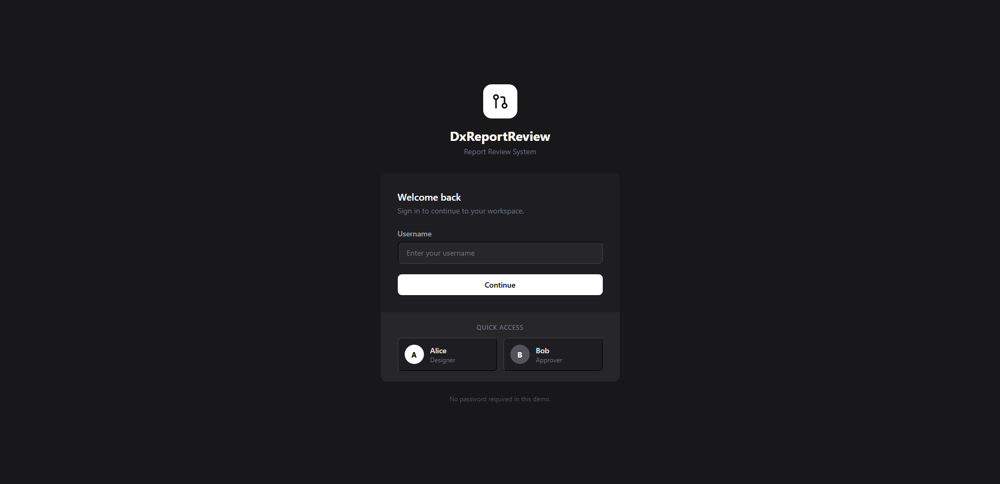
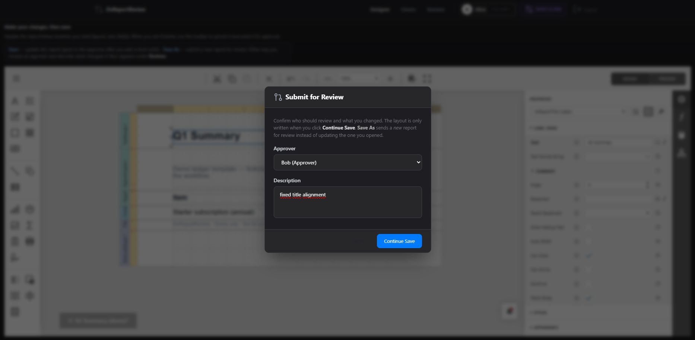
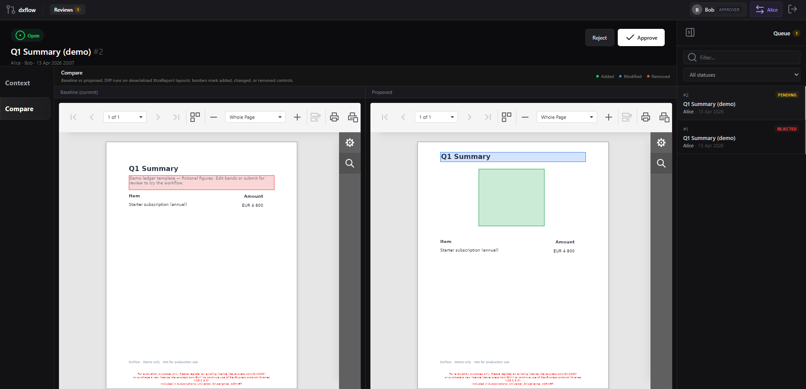
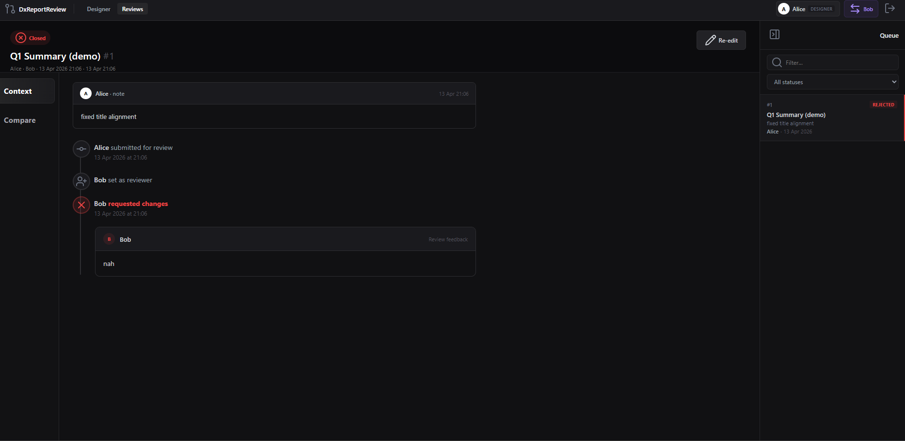

# DxReportReview

## Why this exists

In many organizations, a DevExpress report is “live” as soon as someone hits Save. That is fine until it isn’t: a layout change ships quietly, the totals band moves, a label binds to the wrong field — and the wrong numbers reach a director’s PDF. Or a designer edits the production layout by mistake and there is no review step, no second pair of eyes, and no clean way to roll back except restore from backup.

This sample is built around that gap. It adds a **merge-request-style step**: proposed layout goes to a queue, an approver compares **baseline and proposed** in the real Web Document Viewer, and only **approve** writes through to storage. The point is straightforward: **review first, then publish** — so what goes live is what someone actually agreed to.

## Why the diff is not a text diff on XML

A line-oriented `git diff` on `.repx` is the wrong abstraction. Attribute order, whitespace, and serialization noise drown out what actually moved; reordering controls can look like the entire file changed. The meaningful unit of change is the **report object graph**: bands, controls, layout properties — the same structures the designer and viewer already understand.

So **`ReportDiffService`** works on **`XtraReport`** instances, not on raw XML strings. That is the core design choice.

## ReportDiffService

It compares **baseline and proposed** as deserialized **`XtraReport`** graphs: flatten leaf controls, **pair** corresponding controls (name and path first, then per-type similarity with **Hungarian** matching, then a small location fallback), then mark each as added, removed, or changed and **apply highlights** for the viewer. The full algorithm, weights, edge cases, and color legend are in **`docs/devexpress-integration.md`** (section **ReportDiffService**); implementation: **`src/DxReportReview.Web/Reporting/ReportDiffService.cs`**.

## What the app does

Designers submit proposed bytes to a review queue. Approvers open the comparison; approve merges into `IReportStorage` after **conflict checks** (stale baseline, wrong approver, non-pending state). Integration goes through **`ReviewAwareReportStorage`** (`ReportStorageWebExtension`), with **synthetic `REVIEW_*` URLs** so the viewer renders diff-decorated layouts. **`ReviewModeMiddleware`** passes approver context from session into the same request as DevExpress **`SetData`**, which is how the designer save path stays consistent with DevExpress’s request model.

This repository is **reference wiring**: in-memory storage, demo auth, fixed users. Replace **`IReportStorage`** / **`IReviewRepository`** with your own implementations for production concerns (durable storage, audit, identity). See **`docs/architecture.md`** and **`docs/devexpress-integration.md`**.

## Run

Requires a [DevExpress NuGet](https://nuget.devexpress.com) feed key. Copy `.env.example` to `.env`, set `DEVEXPRESS_NUGET_KEY`, then:

```bash
docker compose -f infra/docker-compose.yml --env-file .env up --build
```

App: http://localhost:8080 — demo users `alice` (designer) and `bob` (approver); passwordless cookie login.

## Stack

- **.NET** 9 (`net9.0`).
- **DevExpress** `DevExpress.AspNetCore.Reporting` and `DevExpress.Drawing.Skia` at **25.2.3** (see `src/DxReportReview.Web/DxReportReview.Web.csproj`).
- **Drawing:** Skia for Linux/Docker.
- **Diff:** `FastHungarian` for control pairing in `ReportDiffService`.

Trial NuGet packages may **watermark** exports until a full license is deployed on the server.

## Screenshots

Files live in **`docs/screenshots/`**.

**Sign in** — demo login (`alice` / `bob`).



**Submit for review** — designer save flow before the layout hits the queue.



**Baseline vs proposed** — approver compare in the Web Document Viewer.



**After reject** — state or screen after a submission is rejected (re-edit path).



## Notes

Restarting Docker wipes state. Documentation and user-visible strings are **English**; keep them that way in contributions.

## License

Source code in this repository is under the [MIT License](LICENSE). That applies to **this sample only**. **DevExpress** NuGet packages are governed by [DevExpress’s terms and EULA](https://www.devexpress.com/Support/EULAs/); use of those components requires a license appropriate to your deployment.
